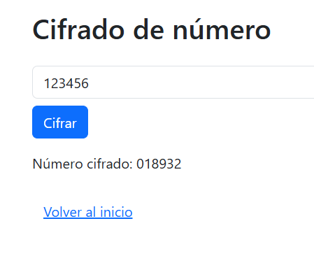
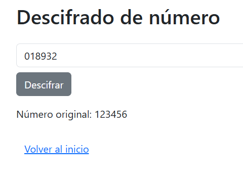

# Aplicación de Cifrado y Descifrado de Números

## 📌 Introducción

Esta aplicación web tiene como propósito desarrollar una interfaz gráfica sencilla utilizando Dash en Python, que permita al usuario cifrar y descifrar números enteros de 6 dígitos. El objetivo principal es aplicar buenas prácticas de programación y diseño modular, utilizando estructuras claras, separación en módulos, entorno virtual y documentación adecuada del código.

---

## 💻 Desarrollo

La aplicación cuenta con tres vistas principales:

1. **Vista Principal**  
   Muestra información del autor y botones de navegación.

2. **Ventana de Cifrado**  
   Permite ingresar un número de 6 dígitos, aplicando el siguiente algoritmo:
   - A cada dígito se le suma 7 y se toma el módulo 10.
   - Luego se intercambian las posiciones:
     - 1° con 3°, 2° con 4°, y 5° con 6°.

3. **Ventana de Descifrado**  
   Invierte el proceso anterior para recuperar el número original.

---

## 🧪 Pruebas de funcionalidad

A continuación, se presentan ejemplos de prueba que demuestran el funcionamiento correcto:

| Entrada Original | Cifrado | Descifrado |
|------------------|---------|------------|
| 123456           | 018967  | 123456     |
| 000000           | 777777  | 000000     |
| 987654           | 410398  | 987654     |

Las pruebas fueron realizadas a través del navegador usando la interfaz proporcionada por la aplicación Dash.

### 🔓 Home

### 🧪 Ejemplo: Cifrado

---

### 🔓 Ejemplo: Descifrado

---

## ✅ Cómo ejecutar

1. Clona el repositorio:

    git clone https://github.com/tu_usuario/encrypt_app.git
    cd encrypt_app

2. Crea y activa el entorno virtual:

    python -m venv venv
    source venv/Scripts/activate  # En Git Bash o Linux/macOS

3. Instala las dependencias:

    pip install -r requirements.txt

4. Ejecuta la aplicación:

    python app.py

Navega a http://127.0.0.1:8050 en tu navegador.

---

## 🎓 Conclusión

El desarrollo de esta aplicación permitió poner en práctica conceptos clave como:
- Modularización de código.
- Uso de entornos virtuales y gestión de dependencias.
- Creación de interfaces gráficas web con Dash.
- Aplicación de lógica de cifrado y descifrado basada en transformaciones matemáticas.

Se reforzó además la importancia de seguir buenas prácticas como documentación (docstrings), uso de snake_case, separación de lógica y vistas, y uso de herramientas modernas como Git y GitHub para control de versiones.

---

## ✍️ Autor

Javier Sánchez  
